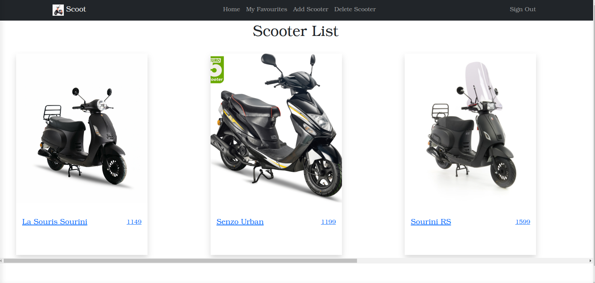
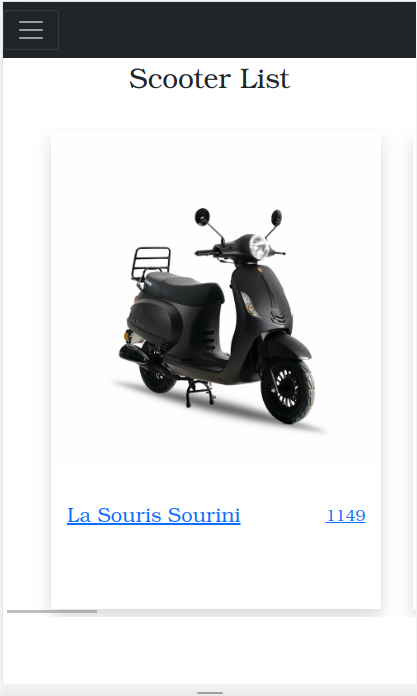

# rent-a-scooter-front-end

A responsive front end application for rent-an-item project. It is a web application based on react-redux, the application shows to the user a collection of scooters fetched from an API, the details include scooter name, photo, price and discription.
The user can sign up and add new scooters to the collection and have their own favorites collection.


# screenshots
[Screenshot](./images/screenshot-desktop.png)
> |||!

# Live link for API

 [Click Me!](https://cryptic-anchorage-52984.herokuapp.com)

## Built With

- React
- Redux
- VScode
- Linters
- Git & GitHub
## Getting Started
In your terminal, run the following commands:

``` 
git clone https://github.com/phelian23/rent-item-frontend.git
cd rent-item-frontend
npm install
npm start

```

## Authors

Our team is composed of:

👤 **Oluwafemi Awoyemi**
- GitHub: [@phelian23](https://github.com/phelian23)
- LinkedIn: [Oluwafemi Awoyemi](https://www.linkedin.com/in/oluwafemi-awoyemi/)

👤 **Munsa Mibenge**
- GitHub: [@Munsa1](https://github.com/Munsa1)
- LinkedIn: [@Munsa1](https://www.linkedin.com/in/munsa-mibenge/)

👤 **Rayan Rassam**
- GitHub: [@Rayan84](https://github.com/Rayan84)
- LinkedIn: [@Rayan84](https://www.linkedin.com/in/rayan-rassam/)

## 🤝 Contributing

Contributions, issues, and feature requests are welcome!

Feel free to check the [issues page](../../issues/).

## Show your support

Give a ⭐️ if you like this project!

## Acknowledgments

- [Alexey Savitskiy](https://www.behance.net/alexey_savitskiy) for the awesome [design](https://www.behance.net/gallery/37706679/Circle-(Landing-page-Dashboard-Mobile-App)) for our front-end.
## 📝 License

- This project is [MIT](./LICENSE) licensed.